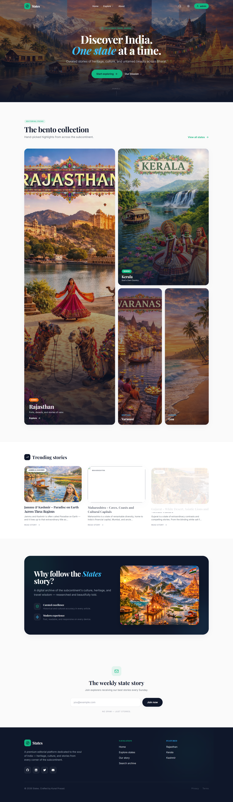
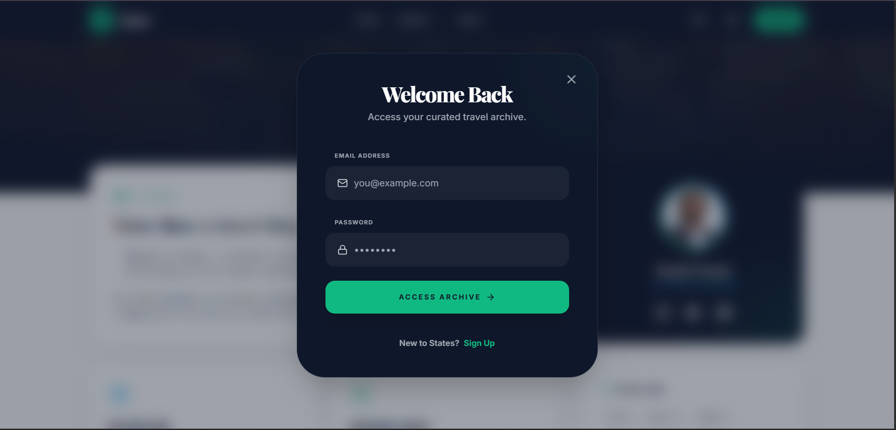

#  States — Discover Incredible India

[🔗 Live Demo](https://state-stories.vercel.app) | [⚙️ Live API](https://state-stories-api.vercel.app/api/health)

A full-stack MERN blog showcasing Indian states through curated travel stories, search, JWT authentication, and community comments. Built with React, Express, MongoDB, and Tailwind CSS, deployed on **Vercel** (separate frontend + API projects).

**Live stack:** React 19 · Express 5 · MongoDB Atlas · Framer Motion · Tailwind CSS

---

## Features

- Editorial home page with bento grid and trending articles from the API
- Article pages with rich content, travel tips, and share links
- Search across titles, states, and content
- User registration / login (JWT + bcrypt)
- Authenticated comments on articles
- Dark mode, responsive layout, accessible navigation
- Rate limiting, Helmet, Joi validation, XSS-safe comments

---

---

## 📸 Application Preview

| 🏛️ Home Page (Bento Grid Layout) | 🔐 Interactive Signup (JWT Auth) |
| --- | --- |
|  |  |

---


## Project structure

```text
MERN-Blog/
├── client/                    # React frontend (Vercel root: client)
│   ├── public/
│   │   └── images/            # Static images (required for deploy)
│   ├── src/
│   │   ├── components/        # Navbar, Footer, AuthModal, UI kit
│   │   ├── components/ui/     # Button, ArticleCard, Spinner, etc.
│   │   ├── config/            # API_BASE_URL
│   │   ├── context/           # AuthContext
│   │   ├── pages/             # Home, Article, ArticlesList, …
│   │   ├── services/          # api.js fetch client
│   │   └── utils/             # readTime, excerpts
│   ├── vercel.json            # SPA rewrites
│   └── package.json
├── server/                    # Express API (Vercel root: server)
│   ├── db.js                  # MongoDB cache for serverless
│   ├── middleware/
│   ├── models/
│   ├── routes/
│   ├── services/
│   ├── seed.js                # Seed articles into Atlas
│   ├── server.js
│   ├── vercel.json
│   └── .env.example
├── docs/
│   └── DEPLOYMENT.md          # Vercel + env checklist
├── package.json               # Backend deps + dev scripts
└── .gitignore
```

---

## Prerequisites

- **Node.js** 18+
- **MongoDB Atlas** (or local MongoDB for development)
- **Git** + **GitHub** account
- **Vercel** account (two projects: API + frontend)

---

## Local development

### 1. Clone and install

```bash
git clone https://github.com/coolkunal9/state-stories.git
cd MERN-Blog

npm install
cd client && npm install && cd ..
```

### 2. Environment variables

**Server** — copy `server/.env.example` to `server/.env`:

```env
MONGO_URI=your_mongodb_connection_string
PORT=8000
NODE_ENV=development
JWT_SECRET=your_long_random_secret
CLIENT_URL=http://localhost:3000
```

**Client** — copy `client/.env.example` to `client/.env`:

```env
REACT_APP_API_URL=http://localhost:8000/api
```

### 3. Seed the database (first time)

```bash
npm run seed
```

### 4. Run

**Option A — both at once (from repo root):**

```bash
npm run dev
```

**Option B — two terminals:**

```bash
# Terminal 1
npm start

# Terminal 2
cd client && npm start
```

- Frontend: http://localhost:3000  
- API: http://localhost:8000  
- Health: http://localhost:8000/api/health  

---

## Deploy on Vercel

Use **two Vercel projects** linked to the same GitHub repo.

| Project | Root directory | Build command | Output |
|---------|----------------|---------------|--------|
| **API** | `server` | — | Serverless (`server.js`) |
| **Frontend** | `client` | `npm run build` | `build` |

### API environment variables

| Variable | Description |
|----------|-------------|
| `MONGO_URI` | MongoDB Atlas connection string |
| `JWT_SECRET` | Strong secret for production |
| `NODE_ENV` | `production` |
| `CLIENT_URL` | `https://your-frontend.vercel.app` (no trailing slash) |

**Atlas:** Network Access → allow `0.0.0.0/0` for Vercel.

### Frontend environment variables

| Variable | Description |
|----------|-------------|
| `REACT_APP_API_URL` | `https://your-api.vercel.app/api` |

Redeploy the frontend after changing `REACT_APP_API_URL` (baked in at build time).

Full checklist: [docs/DEPLOYMENT.md](docs/DEPLOYMENT.md)

---

## Push updates to GitHub

```bash
cd MERN-Blog
git status
git add .
git commit -m "Update: premium UI, API fixes, README and deploy prep"
git push origin main
```

Vercel redeploys automatically when connected to your branch.

**Never commit:** `server/.env`, `client/.env`, `node_modules/`, `client/build/`

---

## API overview

| Method | Endpoint | Description |
|--------|----------|-------------|
| GET | `/api/health` | Health + DB status |
| GET | `/api/articles` | List articles |
| GET | `/api/articles/:name` | Single article + comments |
| POST | `/api/articles/:name/comments` | Add comment |
| POST | `/api/auth/register` | Register |
| POST | `/api/auth/login` | Login |

---

## Scripts (repo root)

| Command | Description |
|---------|-------------|
| `npm start` | Start API on port 8000 |
| `npm run server` | API with nodemon |
| `npm run client` | Start React dev server |
| `npm run dev` | API + React together |
| `npm run seed` | Seed articles to MongoDB |

---

## Author

**Kunal Prasad** — Full-stack developer  
[GitHub](https://github.com/coolKunal9) · [LinkedIn](https://www.linkedin.com/in/kunal-prasad-7676392bb/)

---

## License

ISC
